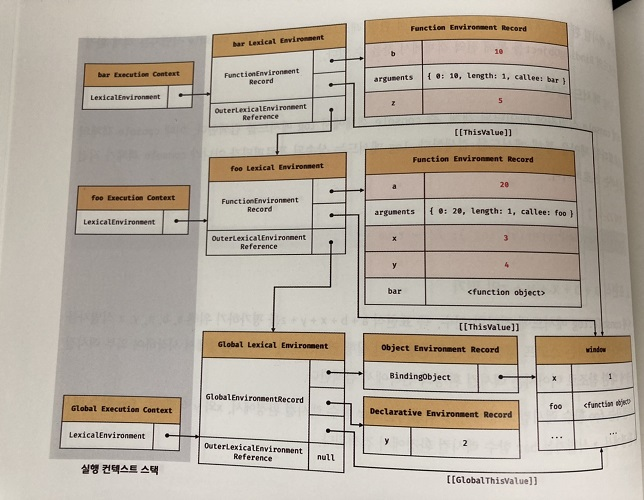
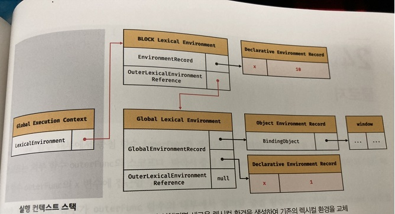

# 실행 컨텍스트

실행 컨텍스트는 자바스크립트의 동작 원리를 담고 있는 핵심 개념이다.

실행 컨텍스트는 자바스크립트 엔진이 코드를 실행할 때 코드에 제공할 환경 정보들을 모아놓은 객체로 스택의 구조로 운영된다.


## 실행 컨텍스트의 종류

실행 컨텍스트는 크게 3가지로 나눌 수 있다.

- 전역 컨텍스트
- 함수 실행에 의한 컨텍스트
- eval 함수로 실행되는 컨텍스트


## 코드에 제공할 환경?

앞서 실행컨텍스트가 코드에 제공할 환경정보들을 모아놓은 객체라고 말했다.

그렇다면 코드에 제공할 환경정보들은 어떤 것들이 있을까? 크게 다음과 같다.

- 변수 : 전역 변수, 지역 변수, 매개 변수, 함수의 선언
- arguments 객체
- Scope
- this


## 실행 컨텍스트 스택

```js
const x = 1;

function foo() {
    const y = 2;
    
    function bar() {
		const z = 3;
        console.log(x + y + z);
    }
    bar();
}

foo();
```


자바스크립트 엔진은 먼저 전역 코드를 평가하여 전역 실행 컨텍스트를 생성한다. 그리고 함수가 호출되면 함수 코드를 평가하여 함수 실행 컨텍스트를 생성한다.

이때 생성된 실행 컨텍스트는 스택 자료구조로 관리된다. 이를 실행 컨텍스트 스택이라고 한다.


## ECMA-262 Edition3 에서의 물리적 실행 컨텍스트

지금은 ECMA-262 Edition5 부터는 Lexical Environment가 변수 객체와 스코프 체인을 포함하는 개념이 되었지만 알고 있으면 이해하기 편하기 때문에 알고 가는 것도 좋을 것 같다.

실행 컨텍스트는 물리적으로 다음과 같은 3개의 프로퍼티를 갖는다.

- 변수 객체 : 함수 선언, argument 객체, 지역 변수, 전역 변수
- Scope Chain : 변수 객체 + 상위 스코프
- this : Context Object


#### 변수 객체 (Variable Object)

변수 객체가 포함하는 것

- 변수
- 매개변수, 인수
- 함수 선언

이 때, 전역 코드에서는 VO는 전역 객체를 가리키게 되며, 함수 코드에서는 활성 객체를 가리키게 된다.


#### 스코프 체인 (Scope Chain)

이전 스코프 문서에서 다뤘듯이 렉시컬 스코프를 확인하고 해당 스코프에 참조하고자하는 식별자가 없으면 상위 스코프로 올라가서 식별자를 검색하기 위해 사용된다.


#### this

this를 참조하기 위해 사용됨. 이는 함수 호출 패턴에 따라 결정된다.


## ECMA-262 Edition5 이후의 물리적 컨텍스트

이 때부터 VO와 스코프 체인이 Lexical Environment 로 통합된다. 크게 다음과 같이 실행컨텍스트가 구성된다.

```js
ExcutionContext = {
    LexicalEnvironment = [Lexical Environment],
    VariableEnvironment = [Lexical Environment],
    thisbinding = [Object]
}
```

 LexicalEnvironment 는 크게 다음과 같이 구분된다.

```
LexicalEnvironment = {
    "Environment Record" = ,
    "Outer Environment Reference" = ,
}
```


#### 환경 레코드 (Environment Record)

스코프에 포함된 식별자를 등록하고 등록된 식별자에 바인딩된 값을 관리하는 저장소이다. 환경 레코드는 소스코드의 타입에 따라 관리하는 내용에 차이가 있다.

#### 외부 렉시컬 환경에 대한 참조 (Outer Lexical Environment Reference)

외부 렉시컬 환경에 대한 참조는 상위 스코프를 가리킨다. 이때 상위 스코프란 외부 렉시컬 환경, 즉 해당 실행 컨텍스트를 생성한 소스코드를 포함하는 상위 코드의 렉시컬 환경을 말한다. 외부 렉시컬 환경에 대한 참조를 통해 단방향 링크드 리스트인 스코프 체인을 구현한다.


#### VariableEnvironment

Lexical Environment과 대게 동일한 값을 갖는다. 그러나 만들어진 변수 선언 및 함수 선언에 대해 바인딩을 유지한다.

- LexicalEnvironment는 코드 실행 중에 실행 컨텍스트 내에서 변경될 수 있지만 VariableEnvironment는 항상 값을 유지한다.
  - LexicalEnvironment는 일시적으로 LexicalEnvironment 하위에 새로운 환경을 가리킨다.
  - 이 새로운 환경은 **임시 바인딩**을 보유한다.
  - 그리고 임시 범위를 벗어나면 VariableEnvironment가 참조하고 있는 값으로 LexicalEnvironment를 복구한다.


## 실행 컨텍스트 흐름 따라가기

```js
var x = 1;
const y = 2;

function foo (a) {
    var x = 3;
    const y = 4;
    
    function bar (b) {
        const z = 5;
        console.log(a + b + x + y + z);
    }
    bar(10);
}

foo(20);
```




1. #### 전역 객체 생성

   전역 객체는 전역 코드가 평가되기 이전에 생성된다. 이때 전역 객체에는 빌트인 전역 프로퍼티와 빌트인 전역함수, 그리고 표준 빌트인 객체가 추가되며 동작환경에 따라 클라이언트 사이드 또는 특정 환경을 위한 호스트 객체를 포함한다.

2. #### 전역 코드 평가

   1. 전역 실행 컨텍스트 생성

   2. 전역 렉시컬 환경 생성

      2.1 전역 환경 레코드 생성 - 전역 스코프 역할

      ​	2.1.1 객체 환경 레코드 생성 - var키워드로 선언한 전역 변수, 전역 함수, 빌트인 전역 프로퍼티와 빌트인 전역함수, 표준 빌트인 객체 관리

      ​	2.1.2 선언적 환경 레코드 생성 - let, const 키워드로 선언한 전역 변수 관리

      2.2 this 바인딩

      2.3 외부 렉시컬 환경에 대한 참조 결정

3. #### 전역 코드 실행

4. #### foo 함수 코드 평가

   1. 함수 실행 컨텍스트 생성

   2. 함수 렉시컬 환경 생성

      2.1 함수 환경 레코드 생성

      2.2 this 바인딩

      2.3 외부 렉시컬 환경에 대한 참조 결정

5. #### foo 함수 코드 실행

6. #### bar 함수 코드 평가

7. #### bar 함수 코드 실행

8. #### bar 함수 코드 실행 종료

9. #### foo 함수 코드 실행 종료

10. #### 전역 코드 실행 종료


## 실행 컨텍스트와 블록 스코프

```js
let x = 1;

if (true) {
    let x = 10;
    console.log(x); // 10
}

console.log(x); // 1
```




if 문같은 블록 스코프 안에 let이나 const 키워드로 변수가 선언되면 코드블록을 위한 블록 레벨 스코프를 생성한다. 이를 위해 선언적 환경 레코드를 갖는 렉시컬 환경을 새롭게 생성하여 기존의 전역 렉시컬 환경을 교체한다. 이때 새롭게 생성된 if 문의 코드 블록을 위한 렉시컬 환경의 외부 렉시컬 환경에 대한 참조는 if 문이 실행 되기 이전의 전역 렉시컬 환경을 갖는다.


## 참고

- 코어 자바스크립트
- 자바스크립트 Deep Dive
- [iamsjy17 님 블로그](https://iamsjy17.github.io/javascript/2019/06/10/js33_execution_context.html)

- [poiemaWeb](https://poiemaweb.com/js-execution-context)

- [유튜브 동영상](https://www.youtube.com/watch?v=OPc73p2d0T8&feature=emb_title)


